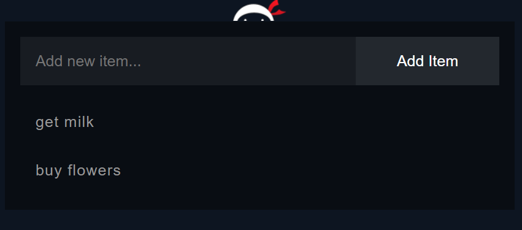

# To do app
Simple To Do app following The Net Ninja's nodejs tutorial. 
Node packages used: nodejs, express, ejs, mongoose.

### Links
* nodejs turorial: https://www.youtube.com/playlist?list=PL4cUxeGkcC9gcy9lrvMJ75z9maRw4byYp
* npm packages: https://www.npmjs.com/
* mlab for mongodb database as a service: https://mlab.com/

### Preview

